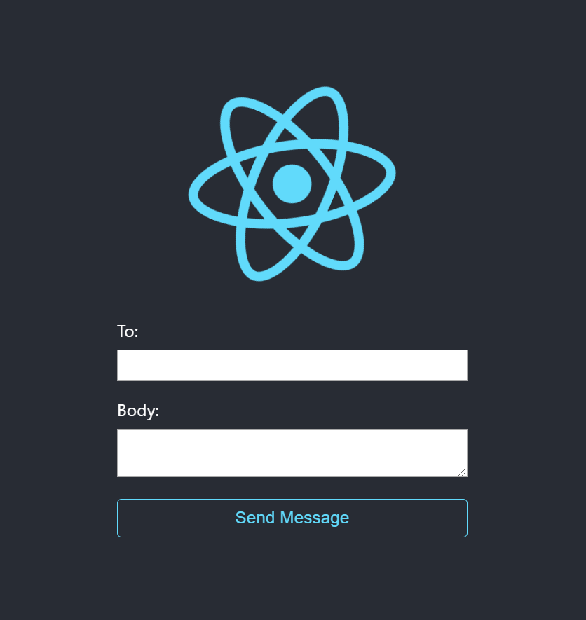

# CS52 Workshops:  Messaging


Brief motivation here as well as in presentation

## Overview

In this tutorial, you will be building a simple client-server app to send text messages via Twilio, a popular service for messaging via a REST API.

## Setup

Clone the provided repo to get started!

## Step by Step

* Explanations of the what **and** the why behind each step. Try to include:
  * higher level concepts
  * best practices

Remember to explain any notation you are using.

### Install dependencies
```javascript
yarn install
yarn upgrade --interactive
touch .env // this is where we will store our Twilio API info
yarn build // this will optimize your project for faster run times during dev
```

At this point, you can verify everything's working by running:
```javascript
yarn run dev // then go to http://localhost:3000/ in your browser
```

### Building the server-side stuff

Now, we need to install the Twilio Node.js module.  
```javascript
yarn add twilio --dev
```

Let's set up your Twilio phone number and API account. Luckily, we can play around with the Twilio API for free with the provided free trial! Follow the steps below:

1. Sign up for free using this link: [Sign up here!](https://www.twilio.com/try-twilio)
2. Verify your email
3. In your Dashboard, click the button to get your __trial number__

Now, in your .env file, add the following (replacing the values with your own):  
```
TWILIO_ACCOUNT_SID=YOUR_ACCOUNT_SID
TWILIO_AUTH_TOKEN=YOUR_AUTH_TOKEN
TWILIO_PHONE_NUMBER=YOUR_TWILIO_PHONE_NUMBER
```

Next, head to your `server/index.js` file. Don't worry about the code that's there, it's just the basics to get your API server running and listening as well as an example route to demonstrate structure.  

Add the following code just below the require statements at the top:

```javascript
const client = require('twilio')(
  process.env.TWILIO_ACCOUNT_SID,
  process.env.TWILIO_AUTH_TOKEN
);
```

This stores the functionality of the Twilio module in our `client` constant.

Since we will be sending the data to this API from our React app, we need our Express app to understand and read JSON. To do this, we add the body parser module's JSON parser:  

```javascript
const app = express();
app.use(bodyParser.urlencoded({ extended: false }));
app.use(bodyParser.json()); // this is the new line
app.use(pino);
```

Now that our API is setup and can understand JSON, we need to create a route that we will use to send a message:

```javascript
// add this below our 'greeting' route
app.post('/api/messages', (req, res) => {

});
```

Since we'll be responding to requests with JSON as well, add the content-type header as shown below (`res` is our 'result'):  

```javascript
app.post('/api/messages', (req, res) => {
  res.header('Content-Type', 'application/json');

});
```

Finally, we will send a message using the `client` constant we created earlier. To do so, we will utilize the `client.messages.create()` method that Twilio provides. 

(Note: this method takes a JSON object w/ at least the 'from', 'to' and 'body' parameters.)

```javascript
app.post('/api/messages', (req, res) => {
  res.header('Content-Type', 'application/json');
  client.messages
    .create({
      from: process.env.TWILIO_PHONE_NUMBER,
      to: req.body.to,      // req.body is what's passed to our API from our client 
      body: req.body.body
    })
    .then(() => {
      res.send(JSON.stringify({ success: true }));
    })
    .catch(err => {
      console.log(err);
      res.send(JSON.stringify({ success: false }));
    });
});
```

SWEET! That's it for the server-side stuff, let's jump into the client!  


### The client-side
#### Creating a simple form
We'll begin working on the client side now! First change into the `src` directory and create a new component named `SMSForm.js`. Let's create a simple form with an input for the phone number, a textarea for the message, and a button to submit.
```js
import React, { Component } from 'react';

class SMSForm extends Component {
render() {
    return (
      <form className="sms-form">
        <div>
          <label htmlFor="to">To:</label>
          <input
             type="tel"
             name="to"
             id="to"
          />
        </div>
        <div>
          <label htmlFor="body">Body:</label>
          <textarea name="body" id="body"/>
        </div>
        <button type="submit">
          Send message
        </button>
      </form>
    );
  }
}
export default SMSForm;
```

Let's make the form a little prettier with some CSS! Create a filed called `SMSForm.css` in your `src` directory and add the following:
``` js
form {
    text-align: left;
    padding: 1em;
  }
  form label {
    display: block;
  }
  form input,
  form textarea {
    font-size: 1em;
    width: 100%;
    box-sizing: border-box;
  }
  form div {
    margin-bottom: 0.5em;
  }
  form button {
    font-size: 1em;
    width: 100%;
  }
  form error {
    outline: 2px solid #f00;
  }
```

Remember to import the CSS at the top of `SMSForm.js`! See if you can import it by yourself.
<details>
 <summary>Click to expand!</summary>
 
 ```js
import React, { Component } from 'react';
import './SMSForm.css';
 ```
</details>

Now you should have have something that looks like this:


If you try typing and submitting something, you'll find out that the form doesn't do anything yet! Let's make our form interactive.

We'll start by setting up some initial state in the constructor of our `SMSForm.js`. We'll need to store the form inputs, whether the form is currently being submitted (so that we can disable the submit button) and whether there was an error. Use the following for the constructor:
```js
class SMSForm extends Component {
  constructor(props) {
    super(props);
    this.state = {
      message: {
        to: '',
        body: ''
      },
      submitting: false,
      error: false
    };
  }

  // rest of the component
}
```

We will also need a method to handle changes in our form and update the state -- just like we did in Lab 3! Write the following code for the method `onHandleChange`.
```js
onHandleChange(event) {
    const name = event.target.getAttribute('name');
    this.setState({
      message: { ...this.state.message, [name]: event.target.value }
    });
  }
```

:exclamation: Remember that we need to bind this method to the object to ensure that `this` is correct! Remember to add it after the `this.state` segment of the constructor. Try to see if you can do it!
<details>
<summary>Click to expand!</summary>
```js
this.onHandleChange = this.onHandleChange.bind(this);
```
</details>

Now we can update our rendered JSX and include our new methods. Again, in `SMSForm.js`, add this to `input` underneath `type`,`name`, and `id`:
```js
value={this.state.message.to}
onChange={this.onHandleChange}
```
Also add this to `textarea` underneath `name` and `id`:
```js
value={this.state.message.body}
onChange={this.onHandleChange}
```

Now run `yarn run dev` again -- your form should be interactive. Use __React dev tools__ for your browser and you should be able to see the state changing.


To hand the form submission, we will build another function called `onSubmit` and use the `fetch` API to make a request to the server. If the response for the server is successful, we will clear the form and set `submitting` to false. If the response is not successful, we will still set `submitting` to false, but also set `error` to true.
```js
 onSubmit(event) {
    event.preventDefault();
    this.setState({ submitting: true });
    fetch('/api/messages', {
      method: 'POST',
      headers: {
        'Content-Type': 'application/json'
      },
      body: JSON.stringify(this.state.message)
    })
      .then(res => res.json())
      .then(data => {
        if (data.success) {
          this.setState({
            error: false,
            submitting: false,
            message: {
              to: '',
              body: ''
            }
          });
        } else {
          this.setState({
            error: true,
            submitting: false
          });
        }
      });
  }
  ```
:exclamation: Remember to bind this method to the object as well! Add this line right after your `onHandleChange` binding in the constructor.

Now we need to add our `onSubmit` method to the form and update the button's `disabled` property.
Update your form to be:
```js
<form
    onSubmit={this.onSubmit}
    className={this.state.error ? 'error sms-form' : 'sms-form'}
>
```
and update your button be:
```js
<button type="submit" disabled={this.state.submitting}>
```
:sparkles: :sparkles: :sparkles:
__YOU'RE DONE!!!__ Congrats! Now you have an interactive form that allows you to text a message to a number. Try entering your number and a message -- you should receive a text from your Twilio number! Additionally, if you type in an unrecognized or bad number, the error red outline will appear.

(Note: Each text you send costs $0.01 -- your free trial gives you $15.50 to begin with, so don't send too many texts!)


## Tim's stuff/recommendations


:sunglasses: GitHub markdown files [support emoji notation](http://www.emoji-cheat-sheet.com/)

Here's a resource for [github markdown](https://guides.github.com/features/mastering-markdown/).

## Use collapsible sections when you are giving away too much code
<details>
 <summary>Click to expand!</summary>
 
 ```js
 // some code
 console.log('hi');
 ```
</details>


## Summary / What you Learned

* [ ] can be checkboxes

## Reflection

*2 questions for the workshop participants to answer (very short answer) when they submit the workshop. These should try to get at something core to the workshop, the what and the why.*

* [ ] 2 reflection questions
* [ ] 2 reflection questions


## Resources

* cite any resources
# React application with Express server

This project was bootstrapped with [Create React App](https://github.com/facebookincubator/create-react-app). Then an Express server was added in the `server` directory. The server is proxied via the `proxy` key in `package.json`.

## Using this project

Clone the project, change into the directory and install the dependencies.

```bash
git clone https://github.com/philnash/react-express-starter.git
cd react-express-starter
npm install
```

Create a `.env` file for environment variables in your server.

You can start the server on its own with the command:

```bash
npm run server
```

Run the React application on its own with the command:

```bash
npm start
```

Run both applications together with the command:

```bash
npm run dev
```

The React application will run on port 3000 and the server port 3001.

## React Twilio starter

The [twilio branch](https://github.com/philnash/react-express-starter/tree/twilio) is a similar setup but also provides endpoints with basic [Access Tokens](https://www.twilio.com/docs/iam/access-tokens) for [Twilio Programmable Chat](https://www.twilio.com/docs/chat) and [Twilio Programmable Video](https://www.twilio.com/docs/video). You can use the project as a base for building React chat or video applications.
